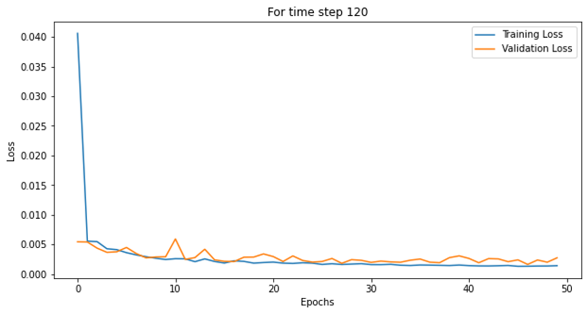
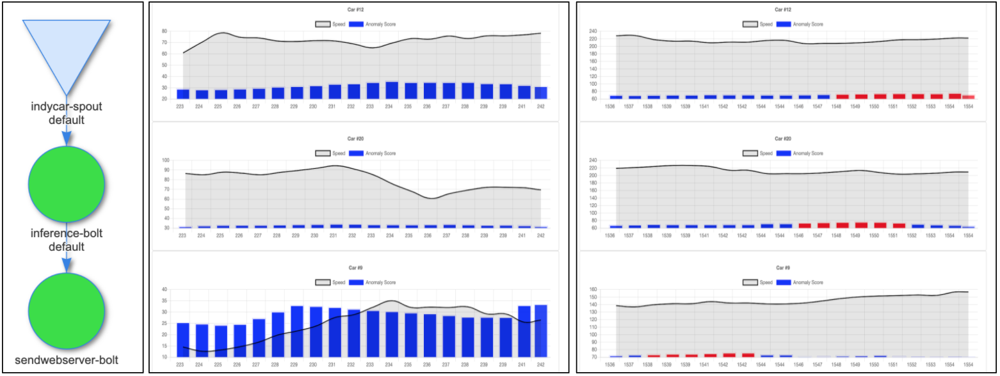

# PROJECT SUMMARY:

## Project Members: Yashvardhan Jain, Vrinda Mathur

## Project Name: Real-time Anomaly Detection on Streaming Race Car Data:

### Project Summary:

IndyCar Series is an annual international car race that hosts 33 participant race cars for a 200 laps race, each lap being 2.5 miles. With the motivation of safety in racing as well as safety in transportation, in general, we have tired to build an anomaly detection model that is able to give us fast and accurate results in real-time.

**Dataset:** The data is structured such that the columns store data for each of the cars, that completed the race while the rows store the speed of each car per second. The data has been manipulated from a log file to be suitable for the LSTM model. 24 cars completed the race and there are close to 12000 datapoints accounting for each second of the race.

Training: 40%, Validation: 10%, Testing: 50%

For the anomaly detection, we have used an LSTM model having 2 LSTM layers stacked together each with 128 hidden units and dropout of 0.5, followed by a Linear layer with a single neuron. The model was varied for different timesteps – 80, 120 and 160 but indicated little to no difference in terms of errors.

With our focus of distributed training and real-time detection for fast and accurate results in real-time, distributed training in Pytorch was implemented and the model with the best training time was used to process real-time streaming data in Apache Storm. We observed the following results:

**Pytorch:**

<table>
  <tr>
   <td><strong>Metric</strong>

<strong>(For time step=80)</strong>
   </td>
   <td><strong>Single Node CPU</strong>

<strong>(1 epoch)</strong>
   </td>
   <td><strong>Single Node GPU</strong>

<strong>(50 epochs)</strong>
   </td>
   <td><strong>Multi Node CPU</strong>

<strong>(1 epoch)</strong>
   </td>
   <td><strong>Multi Node GPU</strong>

<strong>(50 epochs)</strong>
   </td>
  </tr>
  <tr>
   <td><strong>Training_time (s)</strong>
   </td>
   <td>223.3
   </td>
   <td>679.332
   </td>
   <td>123.97/126.68
   </td>
   <td>401.44/399.80
   </td>
  </tr>
  <tr>
   <td><strong>MSE Val set</strong>
   </td>
   <td>0.0086
   </td>
   <td>0.0033
   </td>
   <td>0.0091
   </td>
   <td>0.0031
   </td>
  </tr>
  <tr>
   <td><strong>RMSE Val set</strong>
   </td>
   <td>0.0853
   </td>
   <td>0.0517
   </td>
   <td>0.0877
   </td>
   <td>0.0486
   </td>
  </tr>
  <tr>
   <td><strong>MSE Test set</strong>
   </td>
   <td>0.0044
   </td>
   <td>0.0013
   </td>
   <td>0.0051
   </td>
   <td>0.0011
   </td>
  </tr>
  <tr>
   <td><strong>RMSE Test set</strong>
   </td>
   <td>0.0621
   </td>
   <td>0.0305
   </td>
   <td>0.0666
   </td>
   <td>0.0270
   </td>
  </tr>
</table>

<table>
  <tr>
   <td><strong>Metric</strong>

<strong>(For time step=160)</strong>
   </td>
   <td><strong>Single Node CPU</strong>

<strong>(1 epoch)</strong>
   </td>
   <td><strong>Single Node GPU</strong>

<strong>(50 epochs)</strong>
   </td>
   <td><strong>Multi Node CPU</strong>

<strong>(1 epoch)</strong>
   </td>
   <td><strong>Multi Node GPU</strong>

<strong>(50 epochs)</strong>
   </td>
  </tr>
  <tr>
   <td><strong>Training_time (s)</strong>
   </td>
   <td>799.43
   </td>
   <td>1296.02
   </td>
   <td>383.40/388.39
   </td>
   <td>760.31/758.91
   </td>
  </tr>
  <tr>
   <td><strong>MSE Val set</strong>
   </td>
   <td>0.0109
   </td>
   <td>0.0037
   </td>
   <td>0.0096
   </td>
   <td>0.0030
   </td>
  </tr>
  <tr>
   <td><strong>RMSE Val set</strong>
   </td>
   <td>0.1005
   </td>
   <td>0.0574
   </td>
   <td>0.0904
   </td>
   <td>0.0492
   </td>
  </tr>
  <tr>
   <td><strong>MSE Test set</strong>
   </td>
   <td>0.0058
   </td>
   <td>0.0016
   </td>
   <td>0.0052
   </td>
   <td>0.0011
   </td>
  </tr>
  <tr>
   <td><strong>RMSE Test set</strong>
   </td>
   <td>0.0727
   </td>
   <td>0.0339
   </td>
   <td>0.0669
   </td>
   <td>0.0261
   </td>
  </tr>
</table>
 
 
**Storm:**

 
**Conclusion:**

Good foundation for fast and accurate anomaly detection but there are multiple things that can be done further to enhance the detection. For example, we can combine this research with video data for crash detection. Using millisecond data instead per second data may prove to be beneficial, for the detection may then be more accurate. For faster results, research can also explore a multi-machine-multi-gpu setup and try to advance along the lines of integrating distributed training and inference into a single real-time data streaming pipeline. To conclude, improvements in real-time machine learning models  and  also efficient distributed training  are crucial for various industry applications
