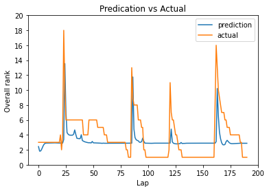
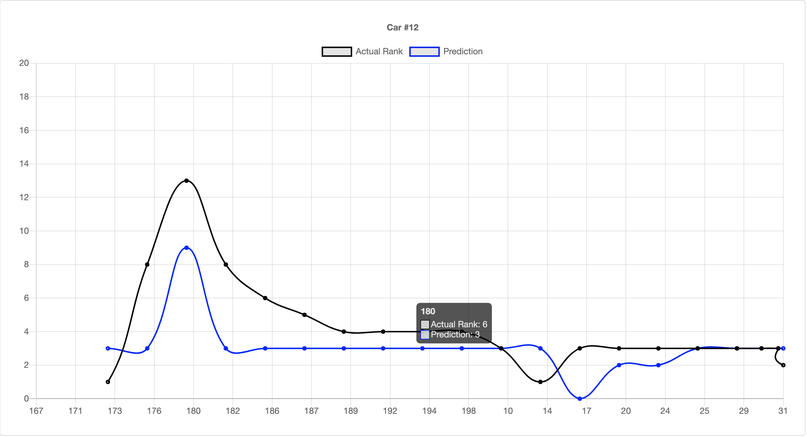

Team Members: Sai Sugeeth Kamineni and Uma Maheswari Gollapudi

Project Name: Real Time Rank Prediction using Time Series on IndyCar data

Summary:

The meteoric rise of Machine Learning has had path-breaking consequences for multiple domains worldwide, particularly having substantial success in making accurate predictions, classifications, and detections, among others. Additionally, there has been a boom in the usage of high-performance computing systems in recent years, with the increasing requirements brought on by large data sizes and processing power. This project is placed at the intersection of both these domains, as we aim to predict real-time ranking estimates of race cars from the IndyCar dataset. Our task comprises extracting the relevant data from the IndyCar data logs, using exploratory data analysis and data preprocessing to isolate the best features, and predicting the real-time ranking of a racecar using an ML model, executed on a distributed environment. We plan to deploy models such as LSTM, Random Forest, LightGBM, among others, using TensorFlow, primarily on Apache Storm. Along the way, we would like to gain insight into building a high- performance computing framework from the ground up and attaining accurate predictions of car ranking.

It is important to note that it has been difficult to find adequate previous work on real time rank prediction in race cars using log data.

Results:

LSTM model Prediction:

Real time prediciton on Storm:

Conclusion:

We were able to achieve good results with real time car ranking forecasting via optimized LSTM’s, which performed 2-4 times better than some machine learning models such as LightGBM Regressor and AdaBoost Classifier. However, one important insight was that certain machine learning models such as random forest and gradient boosting regressors are promising too – to a certain extent. More research and parameter optimization will be useful in this case. Additionally, the project helped us understand the working and usage of Apache Storm, for real time analysis and predictions. For future work, we would like to delve deeper into analyzing the performance of Random Forest and Gradient Boosting regressor, as well as finding better deep learning models to perform the same task. Finally, we also believe it is important to take pitstop interval prediction into direct consideration for rank forecasting.
